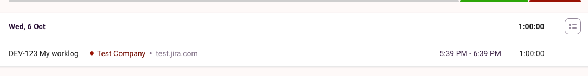

# tracker_bro
Telegram bot for receiving reports from Toggl

So far, the CLI tool for transferring my working hours from Toggl to Jira. It can create duplicates in case you run it twice.

I will help you once if you create an issue with a suggestion or find a bug. Thanks :)

## Usages
For starters, you need to get in the habit of keeping tracker_bro vorlogs in a usable state. He needs to know
 which URL to send logs to and to which task. Here is an example of how to do it:



Here is the *DEV-123* task number and the server address *test.jira.com* that can be configured in the *clients*.

```shell
make install
```

### Usages

```shell
# Build report for current month
ttrack --report

# Demo feature, shows how much you earn if you work 8 hours a day
ttrack --report --hours=8

# Build a stand-up based on yesterday's logs
ttrack --standup

# It'll transfer your work logs to JIRA.
ttrack --start=2021-08-09 --end=2021-08-15
```


## TODO:
- Save Cookie after login by password
- Починить стендап за пятницу
- Добавить тесты + больше документации
- Проверка на ru текст
- Проверка на issue_key в toggle
- Добавить `ttrack init` команду для создания файла конфигурации
